# Easy Kanban - Multi-Tenant Infrastructure Diagram

## Architecture Overview

This diagram shows the complete infrastructure and multi-tenant request flow from end to end.

```mermaid
graph TB
    subgraph "Internet"
        User[👤 User Browser]
    end

    subgraph "AWS - Public Endpoint"
        Nginx[Nginx Reverse Proxy<br/>Public IP: *.ezkan.cloud<br/>SSL Termination]
    end

    subgraph "AWS EKS Cluster"
        subgraph "Ingress Controller"
            Ingress[Kubernetes Ingress<br/>Host-based Routing<br/>fastest.ezkan.cloud → easy-kanban service]
        end

        subgraph "Easy Kanban Pods"
            Pod1[Easy Kanban Pod 1<br/>Port 3010: Vite Preview<br/>Port 3222: Express API]
            Pod2[Easy Kanban Pod 2<br/>Port 3010: Vite Preview<br/>Port 3222: Express API]
            Pod3[Easy Kanban Pod N<br/>Port 3010: Vite Preview<br/>Port 3222: Express API]
        end

        subgraph "SQLite Proxy Service"
            Proxy[SQLite Proxy Pod<br/>Port 3001<br/>Connection Pool Manager<br/>Serial Query Execution]
        end

        subgraph "Redis Service"
            Redis[Redis Pod<br/>Port 6379<br/>Pub/Sub for WebSocket<br/>Real-time Events]
        end
    end

    subgraph "NFS Storage (Shared Volume)"
        subgraph "Tenant Databases"
            DB1[tenants/fastest/kanban.db]
            DB2[tenants/drenlia/kanban.db]
            DB3[tenants/tenantN/kanban.db]
        end

        subgraph "Tenant Attachments"
            Attach1[tenants/fastest/attachments/]
            Attach2[tenants/drenlia/attachments/]
            Attach3[tenants/tenantN/attachments/]
        end

        subgraph "Tenant Avatars"
            Avatar1[tenants/fastest/avatars/]
            Avatar2[tenants/drenlia/avatars/]
            Avatar3[tenants/tenantN/avatars/]
        end
    end

    %% Request Flow
    User -->|HTTPS Request<br/>fastest.ezkan.cloud| Nginx
    Nginx -->|Forward with Host header<br/>X-Forwarded-Host: fastest.ezkan.cloud| Ingress
    Ingress -->|Route to service<br/>Based on Host header| Pod1
    Ingress -->|Route to service<br/>Based on Host header| Pod2
    Ingress -->|Route to service<br/>Based on Host header| Pod3

    %% Application Flow
    Pod1 -->|Extract tenantId from hostname<br/>fastest.ezkan.cloud → 'fastest'| Pod1
    Pod2 -->|Extract tenantId from hostname<br/>drenlia.ezkan.cloud → 'drenlia'| Pod2
    Pod3 -->|Extract tenantId from hostname<br/>tenantN.ezkan.cloud → 'tenantN'| Pod3

    %% Database Proxy Flow
    Pod1 -->|HTTP POST /query<br/>tenantId: 'fastest'<br/>query: SQL, params: []| Proxy
    Pod2 -->|HTTP POST /query<br/>tenantId: 'drenlia'<br/>query: SQL, params: []| Proxy
    Pod3 -->|HTTP POST /query<br/>tenantId: 'tenantN'<br/>query: SQL, params: []| Proxy

    Pod1 -->|HTTP POST /transaction<br/>tenantId: 'fastest'<br/>queries: [batch]| Proxy
    Pod2 -->|HTTP POST /transaction<br/>tenantId: 'drenlia'<br/>queries: [batch]| Proxy
    Pod3 -->|HTTP POST /transaction<br/>tenantId: 'tenantN'<br/>queries: [batch]| Proxy

    %% WebSocket/Real-time Flow
    Pod1 -->|Publish events<br/>redis.publish('task-updated', ...)<br/>tenantId: 'fastest'| Redis
    Pod2 -->|Publish events<br/>redis.publish('task-updated', ...)<br/>tenantId: 'drenlia'| Redis
    Pod3 -->|Publish events<br/>redis.publish('task-updated', ...)<br/>tenantId: 'tenantN'| Redis

    Redis -->|Subscribe to events<br/>tenant-specific channels| Pod1
    Redis -->|Subscribe to events<br/>tenant-specific channels| Pod2
    Redis -->|Subscribe to events<br/>tenant-specific channels| Pod3

    %% Proxy to Database
    Proxy -->|Open connection<br/>/app/server/data/tenants/fastest/kanban.db| DB1
    Proxy -->|Open connection<br/>/app/server/data/tenants/drenlia/kanban.db| DB2
    Proxy -->|Open connection<br/>/app/server/data/tenants/tenantN/kanban.db| DB3

    %% File Storage
    Pod1 -->|Read/Write files<br/>/app/server/data/tenants/fastest/attachments/| Attach1
    Pod1 -->|Read/Write files<br/>/app/server/data/tenants/fastest/avatars/| Avatar1
    Pod2 -->|Read/Write files<br/>/app/server/data/tenants/drenlia/attachments/| Attach2
    Pod2 -->|Read/Write files<br/>/app/server/data/tenants/drenlia/avatars/| Avatar2
    Pod3 -->|Read/Write files<br/>/app/server/data/tenants/tenantN/attachments/| Attach3
    Pod3 -->|Read/Write files<br/>/app/server/data/tenants/tenantN/avatars/| Avatar3

    %% Styling
    classDef userClass fill:#e1f5ff,stroke:#01579b,stroke-width:2px
    classDef nginxClass fill:#fff3e0,stroke:#e65100,stroke-width:2px
    classDef ingressClass fill:#f3e5f5,stroke:#4a148c,stroke-width:2px
    classDef podClass fill:#e8f5e9,stroke:#1b5e20,stroke-width:2px
    classDef proxyClass fill:#fff9c4,stroke:#f57f17,stroke-width:2px
    classDef redisClass fill:#ffebee,stroke:#c62828,stroke-width:2px
    classDef storageClass fill:#fce4ec,stroke:#880e4f,stroke-width:2px

    class User userClass
    class Nginx nginxClass
    class Ingress ingressClass
    class Pod1,Pod2,Pod3 podClass
    class Proxy proxyClass
    class Redis redisClass
    class DB1,DB2,DB3,Attach1,Attach2,Attach3,Avatar1,Avatar2,Avatar3 storageClass
```

## Multi-Tenant Request Flow (Detailed)

```mermaid
sequenceDiagram
    participant User
    participant Nginx as Nginx Reverse Proxy<br/>(AWS)
    participant Ingress as K8s Ingress<br/>(Host-based Routing)
    participant Pod as Easy Kanban Pod
    participant Proxy as SQLite Proxy Service
    participant NFS as NFS Storage

    User->>Nginx: HTTPS: https://fastest.ezkan.cloud/api/tasks
    Note over Nginx: SSL Termination<br/>Host: fastest.ezkan.cloud
    
    Nginx->>Ingress: Forward Request<br/>X-Forwarded-Host: fastest.ezkan.cloud<br/>Host: fastest.ezkan.cloud
    
    Note over Ingress: Route based on Host header<br/>to easy-kanban service
    
    Ingress->>Pod: HTTP Request<br/>Host: fastest.ezkan.cloud
    
    Note over Pod: tenantRouting middleware<br/>Extract tenantId from hostname<br/>fastest.ezkan.cloud → 'fastest'
    
    Pod->>Proxy: HTTP POST /query<br/>{tenantId: 'fastest', query: 'SELECT...', params: []}
    
    Note over Proxy: Get/Create DB connection<br/>for tenant 'fastest'<br/>Queue query for serial execution
    
    Proxy->>NFS: Open/Use connection<br/>/app/server/data/tenants/fastest/kanban.db
    
    NFS-->>Proxy: Database connection<br/>(WAL mode, single writer)
    
    Proxy->>NFS: Execute SQL query<br/>stmt.prepare(query).all(params)
    
    NFS-->>Proxy: Query results
    
    Proxy-->>Pod: JSON Response<br/>{type: 'all', result: [...]}
    
    Note over Pod: Publish WebSocket event<br/>redis.publish('task-updated', ...)
    
    Pod->>Redis: Publish event<br/>Channel: tenant:fastest:task-updated
    
    Pod-->>Ingress: API Response<br/>(JSON)
    
    Ingress-->>Nginx: HTTP Response
    
    Nginx-->>User: HTTPS Response<br/>(JSON data)
    
    Note over Redis,Pod: WebSocket events broadcast<br/>to all pods for tenant 'fastest'
```



## Batch Transaction Flow


## Storage Structure

```
/app/server/data/ (NFS Mount Point)
├── tenants/
│   ├── fastest/
│   │   ├── kanban.db          (SQLite database)
│   │   ├── attachments/       (Task/comment attachments)
│   │   │   ├── file1.pdf
│   │   │   ├── image1.jpg
│   │   │   └── ...
│   │   └── avatars/           (User avatars)
│   │       ├── user1.png
│   │       └── ...
│   ├── drenlia/
│   │   ├── kanban.db
│   │   ├── attachments/
│   │   └── avatars/
│   └── tenantN/
│       ├── kanban.db
│       ├── attachments/
│       └── avatars/
```

## Key Components

### 1. Nginx Reverse Proxy (AWS)
- **Role**: Public endpoint, SSL termination
- **Routing**: Forwards requests to EKS cluster with Host header preserved
- **Tenants**: `*.ezkan.cloud` subdomains

### 2. Kubernetes Ingress
- **Role**: Internal routing within EKS cluster
- **Routing**: Host-based routing to easy-kanban service
- **Preserves**: `X-Forwarded-Host` and `Host` headers

### 3. Easy Kanban Pods
- **Port 3010**: Vite Preview (serves frontend, proxies API)
- **Port 3222**: Express API server
- **Tenant Routing**: Extracts tenant ID from hostname
- **Database Access**: HTTP requests to SQLite Proxy Service

### 4. SQLite Proxy Service
- **Role**: Centralized database access, prevents NFS locking
- **Connection Pool**: One connection per tenant database
- **Query Queue**: Serial execution per tenant (prevents concurrent writes)
- **Endpoints**:
  - `POST /query` - Single query execution
  - `POST /transaction` - Batched transaction (multiple queries)

### 5. Redis Service
- **Role**: Pub/Sub messaging for WebSocket real-time events
- **Channels**: Tenant-specific channels (`tenant-{tenantId}-{event}`)
- **Usage**: 
  - Pods publish events after database updates
  - All pods subscribe to tenant channels for real-time updates
  - Enables multi-pod WebSocket synchronization

### 6. NFS Storage
- **Mount Point**: `/app/server/data/`
- **Structure**: Per-tenant isolation
  - `tenants/{tenantId}/kanban.db` - SQLite database
  - `tenants/{tenantId}/attachments/` - File attachments
  - `tenants/{tenantId}/avatars/` - User avatars
- **Access**: All pods and proxy service mount the same NFS volume

## Multi-Tenant Isolation

1. **Network Level**: Hostname-based routing (`fastest.ezkan.cloud` → `fastest` tenant)
2. **Application Level**: `tenantRouting` middleware extracts tenant ID from hostname
3. **Database Level**: Separate SQLite files per tenant (`tenants/{tenantId}/kanban.db`)
4. **Storage Level**: Separate directories per tenant for files
5. **Proxy Level**: Connection pool maintains one connection per tenant database

## Request Flow Summary

1. **User** → HTTPS request to `https://fastest.ezkan.cloud/api/tasks`
2. **Nginx** → SSL termination, forwards to EKS with Host header
3. **Ingress** → Routes to easy-kanban service based on Host header
4. **Pod** → Extracts `tenantId = 'fastest'` from hostname
5. **Pod** → Sends HTTP request to SQLite Proxy: `{tenantId: 'fastest', query: 'SELECT...'}`
6. **Proxy** → Gets/creates connection to `tenants/fastest/kanban.db`
7. **Proxy** → Executes query on NFS-mounted database
8. **Proxy** → Returns results to Pod
9. **Pod** → Returns JSON response to user

## Performance Optimizations

1. **Batch Transactions**: Multiple queries in single HTTP request to proxy
2. **Connection Pooling**: Reuse database connections per tenant
3. **Serial Execution**: Prevents NFS locking issues
4. **WAL Mode**: Better concurrency for reads
5. **Direct File Access**: Pods access attachments/avatars directly from NFS (no proxy needed)

