# SQLite Proxy Architecture

## Overview

The SQLite proxy architecture ensures single-writer semantics for SQLite databases on NFS by centralizing all database access through a dedicated proxy service.

## Architecture Diagram

```mermaid
graph TB
    subgraph "Kubernetes Cluster"
        subgraph "Easy-Kanban Pods (Multiple Instances)"
            App1[Easy-Kanban Pod 1<br/>tenant: drenlia]
            App2[Easy-Kanban Pod 2<br/>tenant: drenlia]
            App3[Easy-Kanban Pod 3<br/>tenant: anamda]
        end
        
        subgraph "SQLite Proxy Service (Single Pod)"
            Proxy[SQLite Proxy Service<br/>Port 3001]
            Pool[Connection Pool<br/>Map: tenantId → Database]
            Queue1[Query Queue<br/>drenlia]
            Queue2[Query Queue<br/>anamda]
        end
        
        subgraph "NFS Storage (Shared)"
            DB1[(drenlia/kanban.db)]
            DB2[(anamda/kanban.db)]
        end
    end
    
    App1 -->|HTTP POST /query<br/>tenantId: drenlia| Proxy
    App2 -->|HTTP POST /query<br/>tenantId: drenlia| Proxy
    App3 -->|HTTP POST /query<br/>tenantId: anamda| Proxy
    
    Proxy --> Pool
    Pool -->|Get/Create Connection| Queue1
    Pool -->|Get/Create Connection| Queue2
    
    Queue1 -->|Serial Execution| DB1
    Queue2 -->|Serial Execution| DB2
    
    style Proxy fill:#4CAF50
    style Pool fill:#2196F3
    style Queue1 fill:#FF9800
    style Queue2 fill:#FF9800
    style DB1 fill:#9C27B0
    style DB2 fill:#9C27B0
```



## Component Details

### 1. Easy-Kanban Application Pods

**Role**: Handle HTTP requests, business logic, WebSocket connections

**Database Access**:
- **Multi-tenant mode with proxy**: Uses `DatabaseProxy` class
- **Single-tenant or non-proxy**: Uses direct `better-sqlite3` connection

**Key Files**:
- `server/utils/databaseProxy.js` - HTTP client adapter
- `server/middleware/tenantRouting.js` - Routes to correct database
- `server/config/database.js` - Database initialization

**Flow**:
```javascript
// In tenantRouting.js or route handler
const db = await getTenantDatabase(tenantId); // Returns DatabaseProxy or Database
const user = await db.prepare('SELECT * FROM users WHERE id = ?').get(userId);
```

### 2. SQLite Proxy Service Pod

**Role**: Centralized database access, ensures single-writer per database

**Components**:

#### a) Express.js HTTP Server
- **Port**: 3001 (configurable via `PORT` env var)
- **Endpoints**:
  - `POST /query` - Execute single SQL query
  - `POST /transaction` - Execute multiple queries in transaction
  - `GET /health` - Health check
  - `GET /info/:tenantId` - Database info (PRAGMA values)

#### b) Connection Pool (`dbPool`)
- **Type**: `Map<tenantId, Database>`
- **Purpose**: Maintains one `better-sqlite3` connection per tenant database
- **Lifecycle**: 
  - Created on first query for tenant
  - Reused for subsequent queries
  - Closed on pod shutdown

#### c) Query Queues (`queryQueues`)
- **Type**: `Map<tenantId, Promise>`
- **Purpose**: Serializes queries per tenant to prevent concurrent writes
- **Mechanism**: Each query waits for previous query to complete
- **Benefit**: Prevents SQLite locking issues on NFS

**Key File**: `scripts/sqlite-proxy-service.js`

**Configuration**:
- `DB_BASE_PATH` - Base path for tenant databases (default: `/app/server/data`)
- `PORT` - Service port (default: 3001)

### 3. NFS Storage

**Role**: Shared storage accessible by all pods

**Structure**:
```
/data/
  tenants/
    drenlia/
      kanban.db
      kanban.db-wal
      kanban.db-shm
    anamda/
      kanban.db
      kanban.db-wal
      kanban.db-shm
```

**WAL Mode**: Enabled by proxy service for better concurrency
- `kanban.db` - Main database file
- `kanban.db-wal` - Write-Ahead Log
- `kanban.db-shm` - Shared memory file

## Request Flow

### Example: User Login (drenlia tenant)


## Key Design Decisions

### 1. Single Proxy Pod
- **Why**: Ensures only one connection per database
- **Trade-off**: Single point of failure (mitigated by Kubernetes health checks/restarts)

### 2. Query Queuing Per Tenant
- **Why**: Prevents concurrent writes to same database
- **Benefit**: Eliminates SQLite locking issues on NFS
- **Note**: Each tenant has independent queue (parallel processing across tenants)

### 3. Connection Pooling
- **Why**: Avoids connection overhead
- **Benefit**: Reuses connections, faster queries
- **Lifecycle**: Connections persist for pod lifetime

### 4. WAL Mode
- **Why**: Better concurrency than default journal mode
- **Benefit**: Multiple readers, single writer (enforced by queue)
- **Config**: Set by proxy service on connection creation

### 5. HTTP API Design
- **Why**: Simple, stateless, easy to scale
- **Benefit**: Works across network, can add load balancing later
- **Format**: JSON request/response

## Deployment

### SQLite Proxy Service

**Kubernetes Deployment**:
```yaml
apiVersion: apps/v1
kind: Deployment
metadata:
  name: sqlite-proxy
spec:
  replicas: 1  # Single instance for single-writer guarantee
  template:
    spec:
      containers:
      - name: proxy
        image: easy-kanban:latest
        command: ["node", "scripts/sqlite-proxy-service.js"]
        env:
        - name: PORT
          value: "3001"
        - name: DB_BASE_PATH
          value: "/data"
        volumeMounts:
        - name: nfs-storage
          mountPath: /data
      volumes:
      - name: nfs-storage
        nfs:
          server: nfs-server.example.com
          path: /exports/data
```

**Service**:
```yaml
apiVersion: v1
kind: Service
metadata:
  name: sqlite-proxy
spec:
  selector:
    app: sqlite-proxy
  ports:
  - port: 3001
    targetPort: 3001
```

### Easy-Kanban Pods

**Environment Variables**:
```yaml
env:
- name: MULTI_TENANT
  value: "true"
- name: SQLITE_PROXY_URL
  value: "http://sqlite-proxy:3001"  # Kubernetes service name
```

## Benefits

1. **Single Writer Guarantee**: Only proxy pod writes to each database
2. **No Locking Issues**: Query queue prevents concurrent writes
3. **Scalable Reads**: Multiple app pods can read (WAL mode)
4. **NFS Safe**: Works reliably on network file systems
5. **Transparent**: Application code unchanged (async/await pattern)

## Limitations

1. **Single Point of Failure**: Proxy pod failure affects all tenants
   - **Mitigation**: Kubernetes auto-restart, health checks
2. **Network Latency**: HTTP overhead vs direct connection
   - **Mitigation**: Minimal (local network), connection pooling
3. **No Load Balancing**: Single proxy instance
   - **Future**: Could add multiple proxies with database sharding

## Future Enhancements

1. **Proxy Replication**: Multiple proxy pods with leader election
2. **Read Replicas**: Separate read-only connections
3. **Connection Limits**: Per-tenant connection limits
4. **Query Caching**: Cache frequent read queries
5. **Metrics**: Prometheus metrics for monitoring

