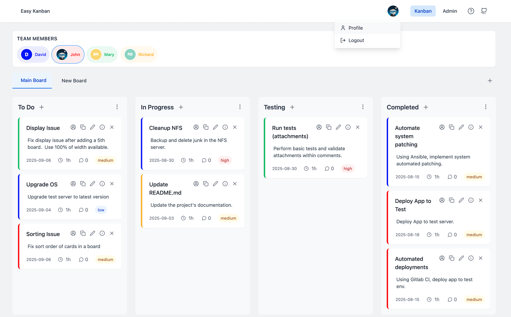
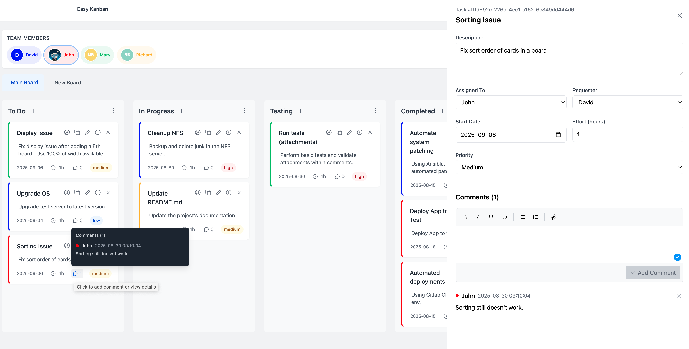
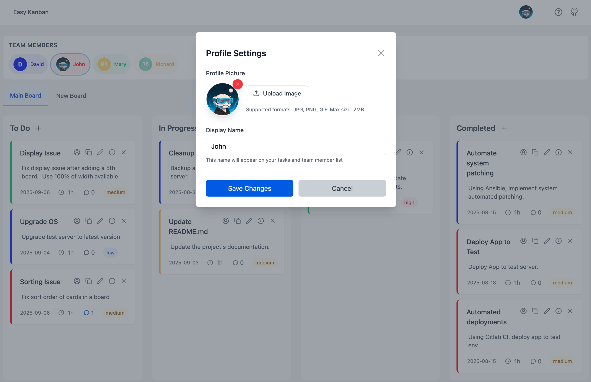
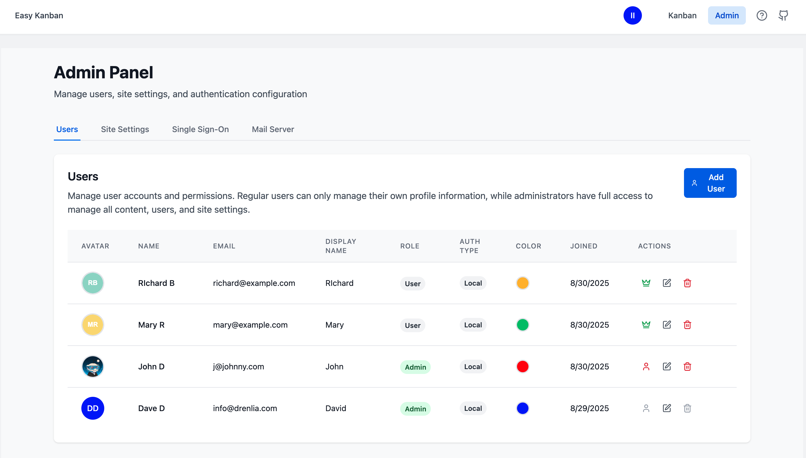
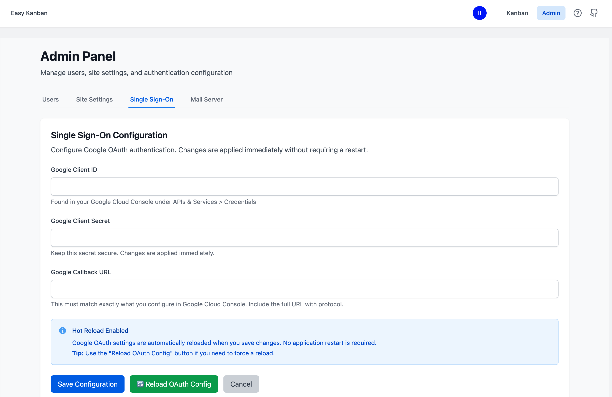
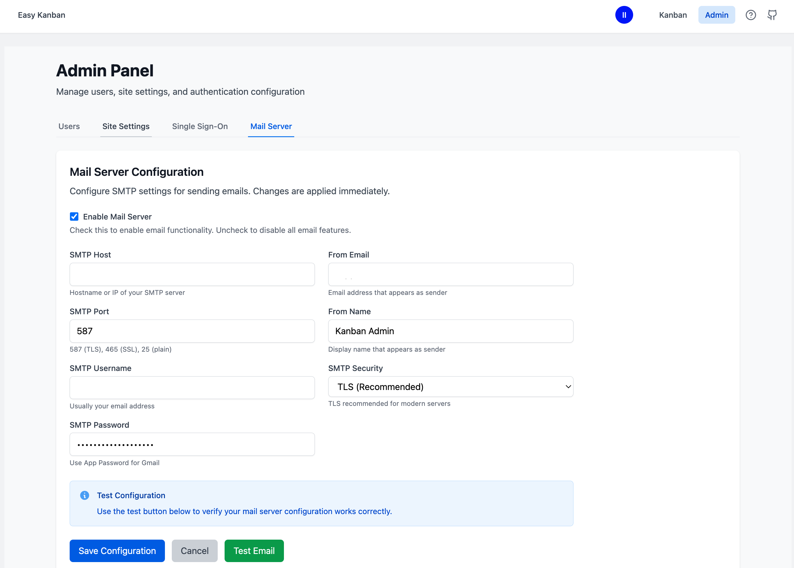

# Easy Kanban Screenshots

This document showcases the key features and interfaces of the Easy Kanban application.

## Overview - Main Kanban Board

The main interface showing the Kanban board with multiple columns, tasks, and team members.

*Features shown: Multi-column layout, color-coded team members, task cards with assignments, drag-and-drop functionality*

---

## Task Details & Comments

Detailed task view with rich text comments, file attachments, and task management options.

*Features shown: Task information panel, comment system with timestamps, file attachment support, task assignment options*

---

## User Profile Management

User profile interface for managing personal settings and avatar.

*Features shown: Profile settings, avatar upload, display name customization, account information*

---

## Admin Panel - User Management

Administrative interface for managing team members and user accounts.

*Features shown: User list with roles, account status management, user creation/editing, permission controls*

---

## Admin Panel - SSO Configuration

Single Sign-On configuration panel for Google OAuth integration.

*Features shown: Google OAuth setup, client ID/secret configuration, callback URL settings*

---

## Admin Panel - Mail Server Settings

Email server configuration for system notifications and communications.

*Features shown: SMTP configuration, email testing, mail server settings, notification setup*

---

## Key Features Demonstrated

- **Multi-board Kanban system** with intuitive drag-and-drop
- **Rich task management** with comments and file attachments
- **User authentication** with profile customization
- **Comprehensive admin panel** for system management
- **Google OAuth integration** for seamless login
- **Email system integration** for notifications
- **Role-based permissions** with admin/user distinctions
- **Modern, responsive UI** that works across devices
